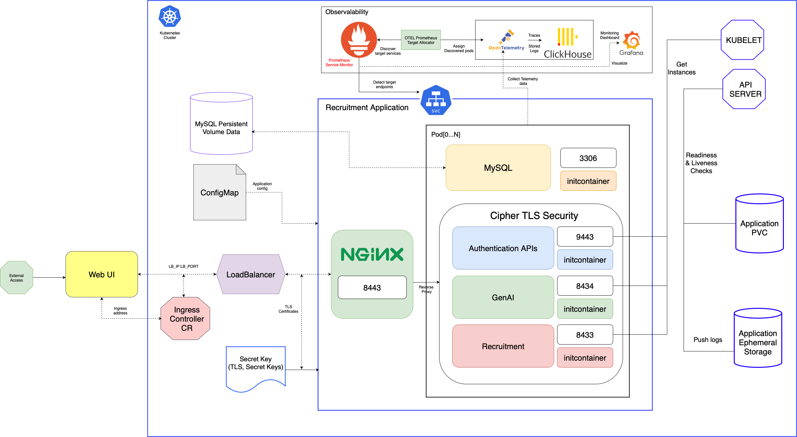
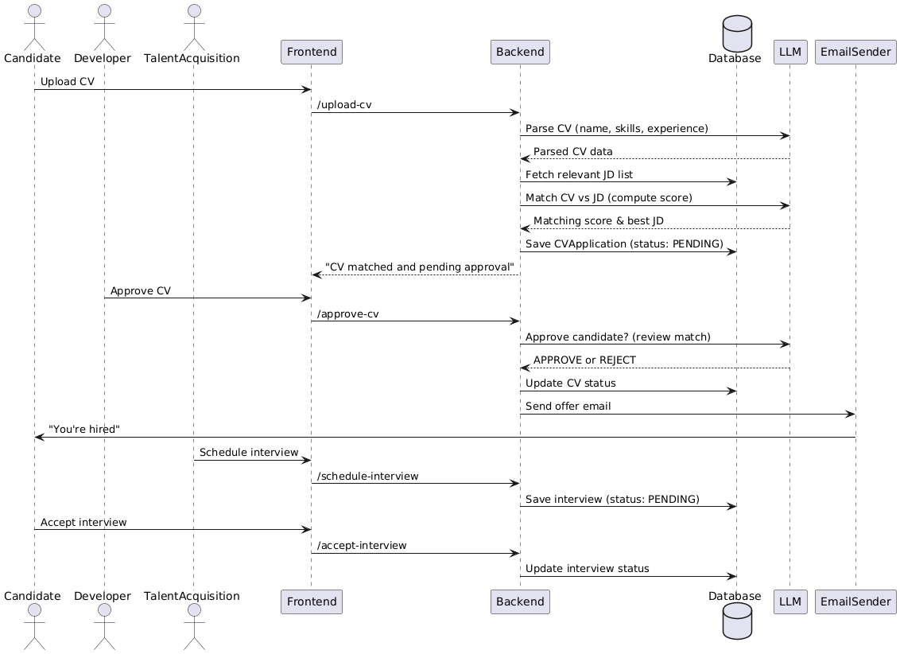

<!--
Document Information:
Prepared by: Tran Anh Dung
Document Name: User Guide
Revision: PA1
Date: 2025-05-01
-->

# Recruitment AI Agent  
## User Guide

---

## Table of Contents

1. [Introduction](#introduction)  
2. [Service Description](#service-description)  
3. [Core Concepts](#core-concepts)  
4. [System Architecture](#system-architecture)  
5. [Workflow Description](#workflow-description)  
   - [CV Upload](#cv-upload-candidate)
   - [CV Review and Approval](#cv-review-and-approval-approver)
   - [Interview Scheduling](#interview-scheduling-talent-acquisition)
   - [Interview Acceptance](#interview-acceptance-candidate)
6. [System Roles](#system-roles)
7. [Dependencies](#dependencies)
8. [Sequence Diagram](#sequence-diagram)

---

## Introduction

The Recruitment AI Agent is an intelligent automation service designed to enhance and accelerate the candidate screening and interview coordination process. It leverages modern language models (LLMs) and microservices to efficiently parse CVs, match them to appropriate job descriptions (JDs), and manage interview workflows.

The goal is to minimize manual effort and ensure a scalable, reliable, and role-based recruitment workflow.

---

## Service Description

This platform enables organizations to automate the following key stages in the recruitment process:

- Parsing of unstructured CV data into structured candidate profiles
- Semantic comparison between candidate profiles and job descriptions
- Reviewer-assisted CV approvals with LLM recommendations
- Coordinated interview scheduling and confirmation workflows
- Secure, role-based access to different functions (Candidate, Reviewer, TA)

The solution is architected for modularity, extensibility, and AI integration.

---

## Core Concepts

### CV Parsing
CV files uploaded by candidates are parsed using an LLM (e.g., OpenAI GPT). The system extracts candidate attributes such as name, skills, experience, and contact details.

### JD Matching
The parsed CV is matched against a list of active job descriptions. The LLM evaluates the similarity and relevance, and assigns a matching score. The best match is recorded along with the application status.

### Role-Based Workflow
The platform enforces strict role separation between candidates, reviewers, and Talent Acquisition (TA) personnel to maintain data integrity and workflow transparency.

### Status Management
Entities in the system follow strict lifecycle statuses:
- CV Application: `PENDING`, `APPROVED`, `REJECTED`
- Interview Schedule: `PENDING`, `ACCEPTED`

---

## System Architecture

The architecture consists of the following components:

- **Frontend**: React-based web interface for user interaction (uploading CVs, managing approvals, scheduling interviews).
- **Backend Services**: RESTful APIs responsible for business logic, data persistence, and interaction orchestration.
- **Database**: Stores CV applications, job descriptions, interview data, and system logs.
- **LLM Integration Layer**: Interfaces with LLM APIs to perform parsing, scoring, and matching logic.
- **Authentication Service**: Implements JWT-based authentication and role-based access control (RBAC).
- **Email Notification Service**: Sends automated emails for offer letters, interview confirmations, and rejections.

---

## Workflow Description

### CV Upload (Candidate)

**Endpoint**: `POST /upload-cv`  
**Description**:
- Candidate uploads their CV through the frontend interface.
- Backend saves the file and sends its contents to the LLM for parsing.
- The system retrieves relevant JDs and invokes the LLM to evaluate matches.
- The highest-scoring match is saved to the database as a new application, with status `PENDING`.
- The frontend notifies the candidate: “CV matched and pending approval”.

### CV Review and Approval (Approver)

**Endpoint**: `POST /approve-cv`  
**Description**:
- Only authorized reviewers (QA or ADMIN) can approve a CV.
- The backend loads the CV data, candidate profile, and match results.
- The LLM may assist in providing a recommendation.
- Upon approval, the application status is updated to `APPROVED`.
- The system triggers an email offer to the candidate via the notification service.

### Interview Scheduling (Talent Acquisition)

**Endpoint**: `POST /schedule-interview`  
**Description**:
- TA staff selects an approved candidate and proposes an interview time.
- The system validates the interview context:
  - Candidate exists
  - JD match exists
  - No time conflict
- On success, interview details are persisted with status `PENDING`.

### Interview Acceptance (Candidate)

**Endpoint**: `POST /accept-interview`  
**Description**:
- Candidate accepts the interview invitation via the frontend.
- System updates the interview status to `ACCEPTED` in the database.

### Deployment View

Recruitment AI Agent Automation Process is packaged as a Docker container. It supports deployment in [Kubernetes][kubernetes] using [Helm][helm].

Figure 1 Deployment view of Recruitment AI Agent Service.

Recruitment AI Agent is dependent on [Cert Manager Service][CertManager] (not shown in picture). If the TLS is enabled.

TLS is enabled byy default in Recruitment AI Agent. This means the [Cert Manager Service][CertManager] must be installed, refer to the [Deployment section](#deployment), which:

* explains how to get started using the Recruitment AI Agent Service in the supported environment.
* specifies configuration options for starting the Recruitment AI Agent Service Docker container.

The Recruitment Docker image supporting two types of architecture: `amd64/arm64`.

---

## System Roles

| Role            | Permissions and Responsibilities                            |
|-----------------|-------------------------------------------------------------|
| Candidate       | Upload CV, accept interviews                                |
| Reviewer (QA)   | View, approve, or reject CVs based on JD matches            |
| Admin           | Same as Reviewer, with access to system configuration       |
| Talent Acquisition | Schedule interviews, monitor CV status, coordinate hiring |

---

## Dependencies

- **Authentication Service**  
  Secure all APIs using JWT-based authentication and enforce RBAC.  
  [Authentication Module](https://gitlab.endava.com/cuong.quang.nguyen/soai/-/tree/main/backend/services/authentication?ref_type=heads)

- **Generative AI Provider**  
  Middleware that connects to various LLM providers such as GPT, Gemini, and Ollama.  
  [GenAI Provider](https://gitlab.endava.com/cuong.quang.nguyen/soai/-/tree/main/backend/services/gen_ai_provider?ref_type=heads)

---

## Sequence Diagram

The diagram below illustrates the complete lifecycle of a candidate's application:

Figure 2 Recruitment Basic Workflow Sequence Diagram.

**Summary**:
- The candidate initiates the process with a CV upload.
- The system parses and scores the CV against job descriptions.
- Reviewers approve or reject based on system recommendations.
- TA coordinates interview scheduling.
- The candidate accepts the interview, concluding the initial workflow.

---

## References

[kubernetes]: https://kubernetes.io
[helm]: https://helm.sh
[CertManager]: https://cert-manager.io/

## Revision History

| Version | Date       | Author         | Description                  |
|---------|------------|----------------|------------------------------|
| PA1     | 2025-05-01 | Tran Anh Dung  | Initial version of the guide |

---
